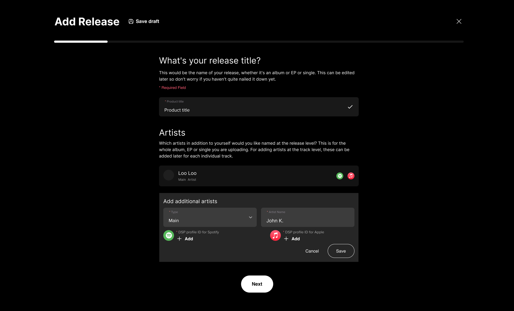
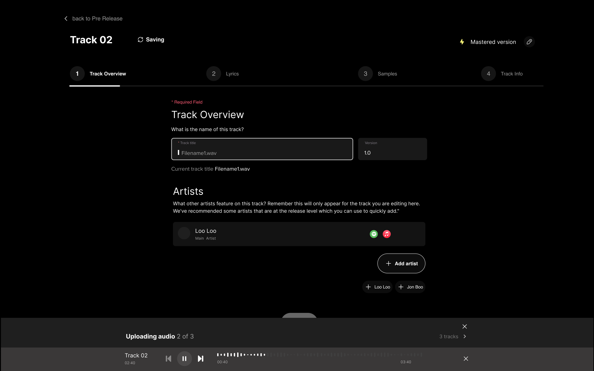

${toc}

# API mappings
## List all products

-  API: [https://next.fugamusic.com/api/docs/v2/#/Product/getProducts](https://next.fugamusic.com/api/docs/v2/#/Product/getProducts)
-  Endpoint: `GET products`
-  Parameters
```
{
  artist_id: <current_artist_id>
}
```
## Get product details

- API: [https://next.fugamusic.com/api/docs/v2/#/Product/getProductById](https://next.fugamusic.com/api/docs/v2/#/Product/getProductById)
## Create product
### Add title
 


- API: [https://next.fugamusic.com/api/docs/v2/#/Product/createProduct](https://next.fugamusic.com/api/docs/v2/#/Product/createProduct)
- Endpoint: `POST api/v2/products`
- Parameters
```
{
  "name": "Your release title",
  "display_artist": "Loo loo",
  "artists": [
    {
      "id": 1001263904959, // current user id
      "primary": true
    }
  ]
}
```
###  Add more artists



- API: [https://next.fugamusic.com/api/docs/v2/#/Product/updateProductById](https://next.fugamusic.com/api/docs/v2/#/Product/updateProductById)
- Endpoint: `PUT api/v2/products/{id}`
- Parameters
```
{
  "artists": [
    {
      "id": 121429,
      "primary": true
    }
  ]
}
```
### Tracks
#### Add a track
- API: [https://next.fugamusic.com/api/docs/v2/#/Product/createProductAssetById](https://next.fugamusic.com/api/docs/v2/#/Product/createProductAssetById)
- Endpoint: `POST api/v2/products/{id}`
- Parameters
```
{
  "name": "string",
  "type": "TRACK"
}
```
- Response
```
{
  id: 1001769561079
}
```
#### Upload track audio

- API: [https://next.fugamusic.com/api/docs/v2/#/Upload/createUploadStart](https://next.fugamusic.com/api/docs/v2/#/Upload/createUploadStart)
- Endpoint: `POST api/v2/upload/start`
- Parameters
```
{
  id: 1001769561079, // asset_id in the above response
  type: "audio"
}
```
#### Get list tracks

- API: [https://next.fugamusic.com/api/docs/v2/#/Asset/getProductAssets](https://next.fugamusic.com/api/docs/v2/#/Asset/getProductAssets)
- Path: `GET api/v2/products/{id}/assets`
### Edit track title



- API: https://next.fugamusic.com/api/docs/v2/#/Product/updateProductAssetById
- Endpoint: `PUT api/v2/products/{id}/assets/{asset_id}`
- Parameters
```
{
  "name": "string"
}
```
#### Add lyrics

- API: [https://next.fugamusic.com/api/docs/v2/#/Product/updateProductAssetById](https://next.fugamusic.com/api/docs/v2/#/Product/updateProductAssetById)
- Endpoint: `PUT api/v2/products/{id}/assets/{asset_id}`
- Parameters
```
{
  "lyrics": "Simple string"
}
```
#### Gerne

- API: [https://next.fugamusic.com/api/docs/v2/#/Product/updateProductAssetById](https://next.fugamusic.com/api/docs/v2/#/Product/updateProductAssetById)
- Endpoint: `PUT api/v2/products/{id}/assets/{asset_id}`
- Parameters
```
{
  "genre": "JAZZ",
  "subgenre": 1001775227048,
  "alternate_genre": null,
  "alternate_subgenre": null,
  "mfit_email_address": null,
  "parental_advisory_next": "NO",
  "available_separately": true,
  "allow_preorder": true,
  "preorder_type": "STANDARD",
  "allow_preorder_preview": false
}
```
#### Writers

- API: [https://next.fugamusic.com/api/docs/v2/#/Product/updateProductAssetById](https://next.fugamusic.com/api/docs/v2/#/Product/updateProductAssetById)
- Endpoint: `PUT api/v2/products/{id}/assets/{asset_id}`
- Parameters
```
{
  "artists": [{
    "id": 1001263904959,
    "name": "Loo loo",
    "primary": true
  }, {
    "id": 1001295870236,
    "name": "Dragon",
    "primary": false
  }, {
    "id": 1001493653156,
    "name": "Dmitry Di",
    "primary": false
  }]
}
```
## Update artwork


Every product has a default image with a unique `id` in FUGA system, when we need to update this image, just upload other image to replace it
### Initialize an upload process
- API: [https://next.fugamusic.com/api/docs/v2/#/Upload/createUploadStart](https://next.fugamusic.com/api/docs/v2/#/Upload/createUploadStart)
- Endpoint: `POST api/v2/upload/start`
-  Parameters
```
{
  id: 1001701741964, // asset_id of the default image
  type: "image"
}
```
### Upload
- API: [https://next.fugamusic.com/api/docs/v2/#/Upload/createUpload](https://next.fugamusic.com/api/docs/v2/#/Upload/createUpload)
### Finish an upload
- API: [https://next.fugamusic.com/api/docs/v2/#/Upload/createUploadFinish](https://next.fugamusic.com/api/docs/v2/#/Upload/createUploadFinish)
